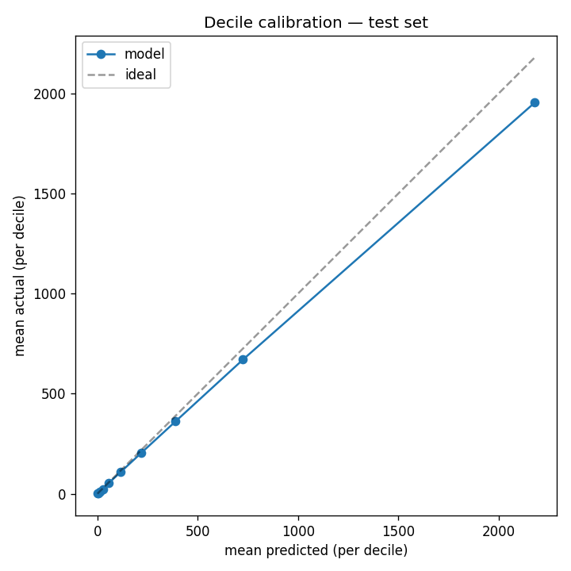

# Model Report — v1.0.0

_Generated: 2026-05-16T21:25:09.186227+00:00_

## Headline metrics (test set)

| metric | value |
|---|---|
| RMSE (counts)        | 182.75 |
| MAE  (counts)        | 65.70 |
| MAPE (non-zero, %)   | 53.4 |
| Pearson r (log1p)    | 0.977 |
| Spearman r           | 0.982 |
| n test rows          | 7,756 (warm 7,756 / cold 0) |

**Pass gate (Spearman ≥ 0.7):** ✅ PASS

## Risk-level distribution on test set

| risk_level | count | pct |
|---|---|---|
| low | 2,424 | 31.3% |
| moderate | 2,394 | 30.9% |
| high | 2,790 | 36.0% |
| very_high | 148 | 1.9% |

## Decile calibration

|   decile |   mean_pred |   mean_actual |   n |
|---------:|------------:|--------------:|----:|
|        0 |        0.59 |          0.46 | 776 |
|        1 |        4.73 |          3.84 | 776 |
|        2 |       12.69 |         10.55 | 775 |
|        3 |       27.77 |         23.91 | 776 |
|        4 |       56.72 |         53.58 | 775 |
|        5 |      115.58 |        108.04 | 776 |
|        6 |      220.01 |        205.34 | 775 |
|        7 |      389.56 |        361.59 | 776 |
|        8 |      726.31 |        670.98 | 775 |
|        9 |     2181.56 |       1955.77 | 776 |

## Per-region MAE (worst first)

| _region                         |    n |    mae |   actual_mean |   pred_mean |   mae_x_median |
|:--------------------------------|-----:|-------:|--------------:|------------:|---------------:|
| South West Ethiopia Region      |  413 | 115.49 |        702.31 |      775.82 |           2.3  |
| Oromia Region                   | 2492 |  97.37 |        480.21 |      541.22 |           1.94 |
| Benishangul Gumuz Region        |  168 |  95.55 |        657.7  |      705.78 |           1.91 |
| South Ethiopia Region           |  728 |  78.85 |        324.78 |      355.33 |           1.57 |
| Amhara Region                   | 1106 |  58.98 |        378.29 |      397.57 |           1.18 |
| Central Ethiopian Region        |  574 |  51.84 |        256.05 |      276.93 |           1.03 |
| Gambella Region                 |   98 |  50.42 |        325.61 |      367.29 |           1.01 |
| Sidama Region                   |  266 |  49.79 |        256    |      280.02 |           0.99 |
| Dire Dawa City Administration   |   63 |  32.82 |        101.4  |      105.61 |           0.66 |
| Tigray Region                   |  651 |  23.58 |        117.53 |      123.39 |           0.47 |
| Afar Region                     |  350 |  21.81 |         90.5  |       94.96 |           0.44 |
| Addis Ababa City Administration |   77 |  17.2  |         70.19 |       82.79 |           0.34 |
| Harari Region                   |   63 |  13.56 |         38.65 |       37.62 |           0.27 |
| Somali Region                   |  707 |   7.59 |         16.12 |       18.73 |           0.15 |

**Regions with MAE > 5× median:** 0 (none ✅)

## Top-20 features (global mean |SHAP|)

| feature                |   mean_abs_shap |   mean_shap |   pct_of_total |
|:-----------------------|----------------:|------------:|---------------:|
| positivity_rate_lag1   |          0.3634 |      0.0664 |        46.4118 |
| Zone                   |          0.1088 |      0.0013 |        13.895  |
| month_index            |          0.0475 |      0.0475 |         6.0633 |
| positivity_rate_lag2   |          0.044  |      0.0058 |         5.6146 |
| organisationunitid     |          0.0407 |     -0.0001 |         5.1913 |
| ADM3_PCODE             |          0.0303 |      0.002  |         3.8664 |
| g_month_cos            |          0.023  |     -0.0084 |         2.9318 |
| tests_lag1             |          0.0219 |     -0.0111 |         2.798  |
| positive_lag1          |          0.0208 |      0.0041 |         2.6509 |
| Rainfall_mm_lag3       |          0.0174 |      0.0042 |         2.2276 |
| Travel                 |          0.011  |      0.0058 |         1.4076 |
| Rainfall_mm_roll3_mean |          0.0069 |      0.0015 |         0.8772 |
| positivity_rate_lag3   |          0.0067 |      0.0001 |         0.8562 |
| Rainfall_mm_lag1       |          0.0037 |     -0.0005 |         0.4745 |
| Rainfall_mm_lag2       |          0.0034 |      0.0008 |         0.43   |
| Humidity_pct_lag1      |          0.0022 |     -0.0003 |         0.2845 |
| g_month                |          0.0021 |      0.0012 |         0.2647 |
| rainfall_anomaly       |          0.0019 |     -0.0005 |         0.2475 |
| Longitude              |          0.0019 |      0.0001 |         0.2392 |
| ec_month               |          0.0018 |     -0      |         0.2316 |

**Pass gate (≥1 climate feature in top-5 SHAP):** ❌ FAIL

## Risk thresholds summary

- per-woreda thresholds: 780
- region fallback: 118
- global fallback: 0
- global cutoffs: p50=38 p75=208 p95=1530

## Model summary

- main booster: 320 trees
- cold-start booster: 375 trees